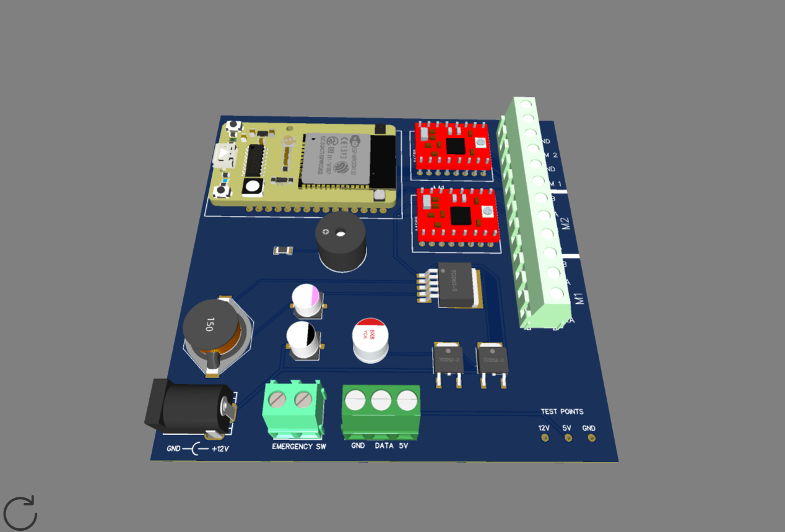

# ESP-32 PLC / Motor Controller

## Description

This is a protype part of my Electrical and Automation Engineering thesis. The goal of the thesis is to create a PLC / Motor Controller that could be used in industrial applications. The PLC communicates with a server using TCP/IP protocol and communicates over the WiFi network.

The PLC is controlled through a desktop application. The desktop application is written in Python and tkinter is used for the GUI. The desktop application is used to send commands to the prototype and to receive data from the prototype.

The desktop application has integrated camera view and AI detection model to detect objects. The AI model is trained using Ultralytics YOLOv8n model.

## More details

The PCB was designed in EasyEDA software. The PCB is designed to be used with the ESP-32 microcontroller. The ESP-32 is a dual core microcontroller with built in WiFi and Bluetooth. The ESP-32 is programmed using Visual Studio Code with the PlatformIO extension.

Screencapture of the designed PCB.

Testing the prototype.

